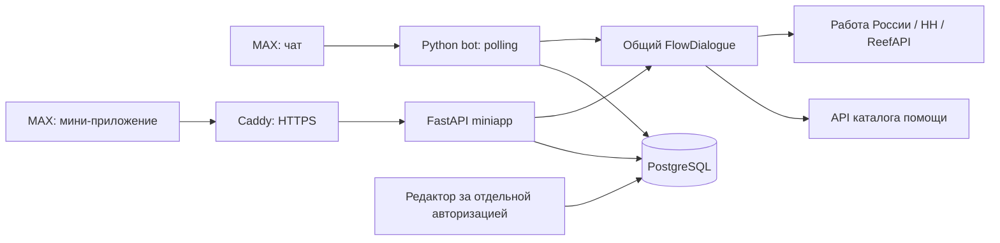

# Техническое описание

## Архитектура

`FlowDialogue` использует опубликованный сценарий, вопросы и фильтры в обоих
интерфейсах. `MiniDialogue` меняет представление для приложения. LLM извлекает
условия из текста; навигация, фильтрация и справочные ответы реализованы
отдельно. LLM не создаёт объявления и не служит источником правовых фактов.

Стек: Python 3.12, FastAPI, asyncpg, PostgreSQL 16, HTTPX, OpenAI-совместимый
LLM-провайдер, HTML/CSS/JavaScript без frontend-сборщика, MAX Bridge, Docker,
Caddy. Python-пакеты зафиксированы в requirements. Docker-образы используют
версионные теги без digest; байтовая воспроизводимость будущих образов не заявляется.

## API

OpenAPI строится из реальных маршрутов miniapp и дополняется описанием ручной
Bearer-проверки, ответов и кодов ошибок. Перегенерация в окружении приложения:
`python -m tools.submission.export_openapi`. Swagger и API редактора наружу
для этого не открываются.

| Маршруты | Назначение |
|---|---|
| GET /api/health, /api/info | БД, режим запуска, имя бота |
| GET /api/help/search, /api/help/summary | Место и количество точек по категориям |
| GET /api/help/points, /api/help/points/{identifier} | Пагинация и карточка |
| POST /api/session | Проверка подписанного запуска MAX |
| POST /api/action | Один шаг общего диалога |
| GET/POST /api/favorites | Личные сохранения |
| POST /api/material | Актуальный справочный ответ и сохранение |
| DELETE /api/account | Удаление сохранений и напоминаний текущего MAX ID |

HTTP 200 у action означает обработанный шаг, а не гарантированные карточки.
Пустая выдача и ошибка поставщика могут быть уведомлением внутри ответа.
Условия обращения к службе и стоимость нужно уточнять у самой организации.

## Данные и защита

MAX-вход: HMAC-SHA256, constant-time сравнение, срок auth_date до часа,
опережение часов до 30 с, отказ при дублировании полей. Затем выдаётся случайный
bearer в памяти страницы. PostgreSQL хранит сохранения по проверенному MAX ID,
чужой ID клиент не передаёт. Новую карточку можно сохранить только после
показа этому сеансу. Снятый справочный материал не показывает прежний текст.

Есть Pydantic-валидация, лимит POST 24 КБ, проверка Origin при его наличии,
no-store, nosniff, no-referrer и CSP. Origin дополняет авторизацию. Текст
карточек рисуется текстовыми DOM-узлами, схемы внешних ссылок проверяются.
Секреты остаются на backend. Редактор отделён и закрыт Basic Auth на прокси.
Повторный запуск одного MAX ID ограничен пятью секундами общей таблицей;
отдельного долговечного nonce-реестра нет. Поэтому полный запрет повторного
использования подписанных init_data в пределах часа не заявляется.

Сеансы чата и приложения раздельные, но оба сохраняются в PostgreSQL в явном
JSON-формате версии 1. Сценарии, избранное и напоминания также хранятся там.
Ссылки шеринга не содержат переписку и условия
поиска. Получатель публичного ответа решает сам, сохранять ли его.
Удаление отдельных сохранений и всех сохранений/напоминаний аккаунта доступно
в «Моём». Удаление закрывает сеансы miniapp и бота этого MAX ID. Политика и ограничение
удаления из резервов описаны в [DATA-POLICY.md](DATA-POLICY.md). Резерв на том
же VPS не защищает от полной потери сервера. Восстановление проверено на
отдельной временной базе. Ежедневные и ручные резервы с дампами в
`/opt/tochka/backups` автоматически удаляются через 30 суток после успешного
создания новой копии.

## Устойчивость и масштаб

Miniapp: до 200 активных сеансов во всей базе, до 8 параллельных обработок
на экземпляр, очередь до 5 с,
обработка до 120 с. В одном сеансе одно действие, частые запросы получают 429.
Есть тайм-ауты, ограниченные повторы и кэши источников. Неподтверждённые
данные не заменяются выдуманной выдачей. На VPS есть проверки здоровья.

Основной miniapp запускается одним worker. Второй временный экземпляр проверен
на той же БД: bearer и навигация работают между процессами. Лимит очереди
остаётся на экземпляр; глобальный лимит запросов не вводился. Бот остаётся
одним MAX poller под PostgreSQL advisory lock.

При 503 или отмене действия miniapp возвращает состояние сеанса к началу шага.
PostgreSQL хранит захват действия до 130 секунд; после успешной обработки ответ
и новое состояние фиксируются вместе. Повтор с тем же Idempotency-Key и телом
получает сохранённый ответ в течение пяти минут; тот же ключ с другим телом
получает HTTP 409 без нового действия. Bearer хранится только как SHA-256, привязан к проверенному
MAX ID и живёт час с последнего действия. Просроченные строки удаляются при
новом входе. Бот хранит состояние FlowSession с тем же часовым TTL; второй
poller с тем же токеном не запускается.

Сохранение карточки, создание напоминания и удаление одного MAX ID используют
общую блокировку владельца в PostgreSQL. После удаления поколение аккаунта
меняется, все bearer этого ID отзываются. Начатое ранее действие не может
записать результат после удаления. Обе очередности проверены на двух процессах.

На чистом Compose и VPS проверено: после рестарта действующий bearer продолжает
сеанс; второй экземпляр принимает тот же bearer и сохраняет навигацию.
После удаления аккаунта оба экземпляра отвечают 401 на старый bearer.

Выпуск r5 меняет обработку повторов miniapp и диагностику LLM. Три изменённых
файла установлены на VPS в admin, miniapp и bot. Серверный HH-клиент уже
отправлял `/areas` без bearer и не перевыпускал токен после 403, поэтому его
не заменяли. Опубликованный сценарий MAX остаётся версией 9 с
`child_only=true`; взрослые роли не включались.

Ранее известное различие `project/llm/services/help_points.py` устранено в
новом комплекте выравниванием с активным VPS. Серверный порядок карточек и
продуктовые тексты не менялись. Результаты нового прогона:
[VERIFICATION.md](VERIFICATION.md).
